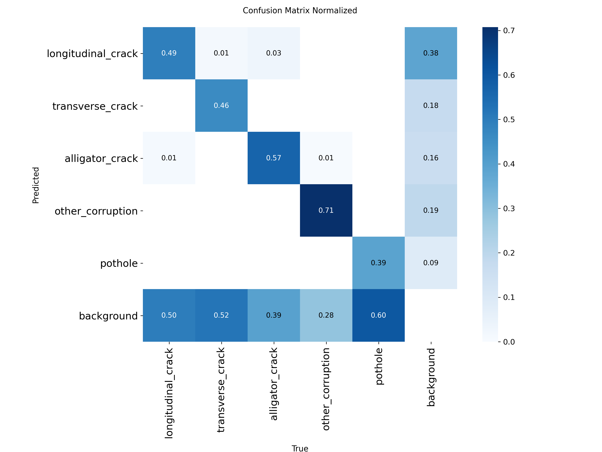
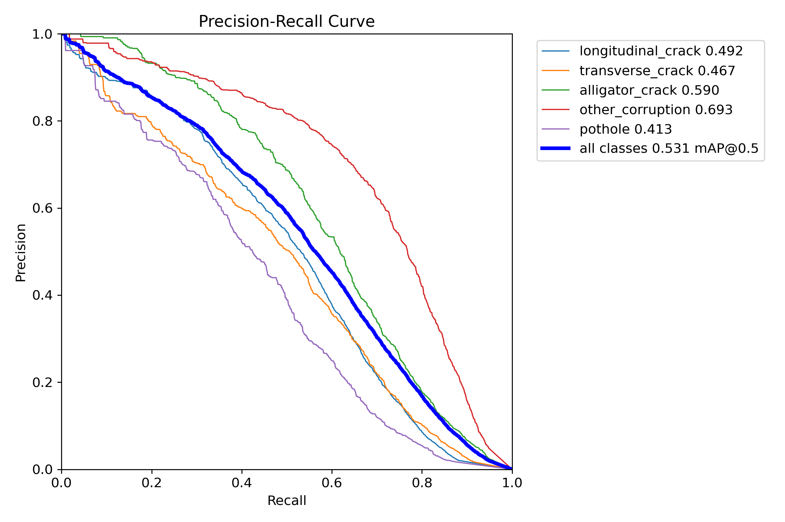

# 🛣️ Road Crack Detection using YOLOv8 with Test-Time Augmentation (TTA)

This project presents an end-to-end object detection pipeline for detecting road surface cracks using YOLOv8, enhanced with Test-Time Augmentation (TTA) and memory-safe chunked inference.
The system is designed to handle large-scale datasets efficiently in constrained environments such as Kaggle notebooks.

## 📌 Problem Statement

Manual inspection of road cracks is:
- **Time-consuming**
- **Costly**
- **Subjective and error-prone**

This project aims to automate crack detection using deep learning, enabling:
- **Faster inspection**
- **Consistent results**
- **Scalability for real-world deployment**

## 🚀 Key Features

- ✅ **YOLOv8 Fine-tuned Model**
- ✅ **Test-Time Augmentation (TTA)** for improved detection robustness
- ✅ **Chunk-based inference** to prevent RAM/GPU crashes
- ✅ **Confidence-based post-processing**
- ✅ **Guaranteed prediction files** for all test images
- ✅ **Submission-ready ZIP generation**

## 🧠 Model & Framework

| Component | Details |
| :--- | :--- |
| **Model** | YOLOv8m |
| **Framework** | Ultralytics YOLO |
| **Backend** | PyTorch |
| **Platform** | Kaggle Notebook |
| **Input Size** | 640 × 640 |
| **Inference Mode** | GPU (if available) / CPU fallback |

**Dataset Link**: [Kaggle Dataset](https://kaggle.com/datasets/2bbd360e1ca39095fb6c6be9a26acbdc759db6ea5b5d75406451230e8ab42260)

### 📂 Dataset Structure

```text
crackathon-data/
└── randomized_dataset/
    ├── train/
    │   ├── images/
    │   └── labels/
    ├── val/
    │   ├── images/
    │   └── labels/
    └── test/
        └── images/
```

- **Test set size**: ~6000 images
- **Labels follow YOLO format**

## 🔄 Pipeline Overview

### Phase 1–7: Model Training (YOLOv8)
- Dataset preparation
- Model fine-tuning
- Validation and metric evaluation

### Phase 8: TTA-based Chunked Inference
To safely process thousands of test images without exhausting memory:
1. Images are processed in chunks of 200
2. TTA (`augment=True`) is applied
3. GPU memory is released after each chunk

```python
CHUNK_SIZE = 200
augment=True
batch=1
```

- ✔ **Prevents RAM/GPU overflow**
- ✔ **Ensures stable inference**

### Phase 9: Post-processing & Confidence Filtering
- Filters predictions using confidence threshold (0.10)
- Ensures every test image has a corresponding `.txt` file
- Empty files are created for images with no detections

- ✔ **Submission-compliant**
- ✔ **No missing prediction files**

### Phase 10: Submission ZIP Creation
Final predictions are packaged into:
```text
submission.zip
└── final_predictions/
    ├── image_001.txt
    ├── image_002.txt
    └── ...
```

## 📊 Evaluation Visualizations

### ✅ Included Images (Best Choice)

The following two images provide maximum insight and are ideal for reports:

#### 1️⃣ Confusion Matrix (Normalized)


**Why?**
- Shows true vs false predictions
- Normalized → easy interpretation across classes
- Essential for performance analysis

#### 2️⃣ Precision–Recall Curve


**Why?**
- Summarizes model quality in one graph
- Strong indicator of detection reliability
- Preferred in research papers and hackathons

## 📈 Results Summary
- **Improved detection stability** using TTA
- **Reduced false negatives** on difficult crack patterns
- **Successfully processed 6000+ images** without memory crashes
- **Submission-ready predictions** generated automatically

## 🧪 Test-Time Augmentation (TTA)
TTA applies multiple transformations (flip, scale, etc.) during inference and merges predictions to improve robustness.

**Benefits:**
- Better generalization
- Improved confidence for borderline detections
- Minimal additional code complexity

## ⚙️ How to Run

### 1️⃣ Install Dependencies
```bash
pip install ultralytics
```

### 2️⃣ Run Inference
```python
model.predict(
    source=images,
    imgsz=640,
    augment=True,
    save_txt=True,
    save_conf=True
)
```

### 3️⃣ Post-process & Zip
Generates `submission.zip`

## 📦 Final Output
- 📁 `final_predictions/`
- 📦 `submission.zip`
- 📊 Evaluation plots
- 📄 Fully reproducible pipeline

## 🔮 Future Improvements
- Class-wise weighted confidence thresholds
- Ensemble of multiple YOLO variants
- Real-time video crack detection
- Deployment using TensorRT / ONNX

## 👨‍💻 Author
**Vishal K R**
- **GitHub**: [VishalKR-12](https://github.com/VishalKR-12)
- **LinkedIn**: [vishal-k-r-b762a0371](https://www.linkedin.com/in/vishal-k-r-b762a0371)

## ⭐ Acknowledgements
- Ultralytics YOLOv8
- Kaggle Platform
- Crackathon Dataset Providers
